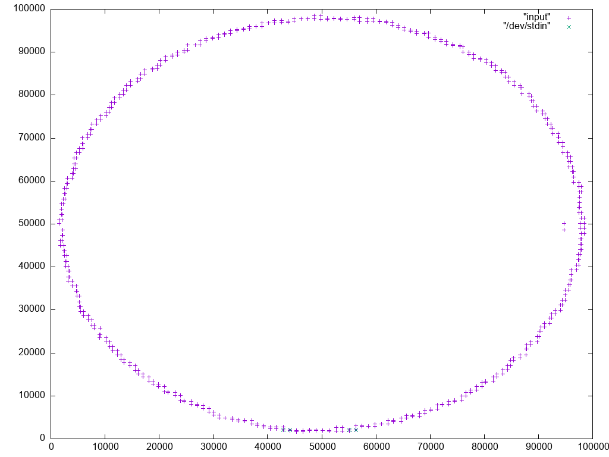

# Day 9: Movie Theater

https://adventofcode.com/2025/day/9

## Part One

A naïve approach would be to calculate the area of every combination of tiles and select the largest. There may be a way to be selective about the tiles chosen. For
example, start at the corners and select two tiles as close to the corner as possible. Continue working inward until the area starts to decrease consistently. It seems
more like a heuristic, but it could work. In any case, now that I've written code to do exactly that, it performs reasonably well. We'll see how I fare in part two.

```
❯ perl area.pl < example | sort -nr | head | column -t
50  11,7  2,3
50  11,1  2,5
40  9,7   2,3
35  11,7  7,1
30  7,1   2,5
30  11,7  2,5
30  11,1  2,3
25  11,7  7,3
24  9,7   2,5
24  2,3   9,5

❯ perl area.pl < input | sort -nr | head | column -t
4758598740  83899,85263  16133,15044
4753034373  83899,85263  13517,17733
4749217110  83254,85798  16133,15044
4746786708  83254,85798  13517,17733
4739812692  83899,85263  12984,18427
4738495824  86595,82291  16133,15044
4738049904  83899,85263  17036,14403
4737796932  83899,85263  15634,15862
4734757536  82084,86784  13517,17733
4734297812  83254,85798  12984,18427
```

## Part Two

Now I want to limit the search to only those areas that include red or green tiles. The example makes it feel like the best approach would be to determine the colors of
the tiles first, then check each rectangle against this grid. That feels computationally expensive. Given that the space is enclosed, I wonder if it would be enough to
check the corner tiles. For example, to confirm that the upper left tile is valid, a red tile must exist somewhere below and to the left of the lower left tile,
including the lower left tile itself. Similarly, for the lower right tile to be valid, a red tile must exist somewhere above and to the right of the upper right tile,
including the upper right tile itself.

My working theory holds up for the example at least. I really hope it holds for the input as well, because I don't know if I'm clever enough to come up with anything
else.

```
❯ perl area.pl 2 < example | sort -nr | head | column -t
24  9,5   2,3
21  11,1  9,7
18  2,5   7,3
15  7,1   9,5
15  11,1  9,5
15  11,1  7,3
9   9,5   7,3
9   9,5   11,7
8   9,5   2,5
7   11,1  11,7

❯ perl area.pl 2 < input | sort -nr | head | column -t
4670137716  16545,84914  83438,15101
4624402842  15981,83748  84254,16016
4614146888  17347,84914  83438,15101
4608929706  16545,84914  83438,16016
4597738950  14745,83245  84254,17101
4594598968  16545,84914  82356,15101
4592139312  16545,83748  83438,15101
4590061020  15981,83245  84254,16016
4590005364  17347,85852  81648,14471
4586201430  16545,83748  84254,16016
perl area.pl 2 < input  12.25s user 0.07s system 99% cpu 12.329 total 32112k max rss
```

No such luck.

After skimming Reddit, I thought to plot my own input. Why the `2096`? After seeing the plot the first time, I wondered if there would be more than two tiles in any
given horizontal or vertical line. There were no more than two tiles with the same x coordinates, but there were four tiles with the same y coordinates. I wanted to see
if this would pose an additional problem.

```
❯ awk -F, '$2 == "2096"' input | gnuplot -e 'set terminal png size 1024,768' -e 'set output "theater.png"' -e 'set datafile separator ","' -e 'plot "input", "/dev/stdin"'
```



After plotting the input, it becomes clear that the tiles are laid out in a large circle, roughly. There are also two tiles that create a long horizontal gap bisecting
the circle, reminiscent of the meridian trench on the Death Star. At the end of this trench was the exhaust port. In any case, it stands to reason that a rectangle of
the largest area must have one corner at one of these two tiles. That dramatically reduces the search space and generally simplifies the problem. For my input, this
reduces the number of rectangles to 436. Of those, only 44 are completely contained within the circle, and it looks like our winner is in the lower half of the circle.

```
❯ perl area.pl 2 < input | sort -n | column -t | tail
1172452083  94727,48597  4671,35579
1181278965  94727,48597  3993,35579
1249603920  4608,64043   94727,50178
1279527210  94727,48597  4842,34363
1281961395  94727,48597  4671,34363
1372203288  94727,48597  5322,33250
1372815759  4725,65430   94727,50178
1379570328  94727,48597  4842,33250
1464982850  5318,66562   94727,50178
1474699155  4725,66562   94727,50178
```
